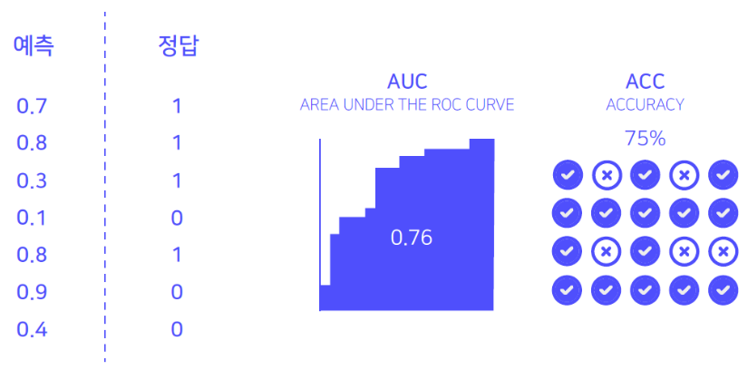

# 1. Data Understanding
## 1.1 Problem Definition

**내가 지금 풀어야 할 문제는?**
* Iscream 데이터 셋을 이용해 DKT 모델을 구축하고, 학생 개개인이 주어진 문제를 맞출지 틀릴지 예측하는 시스템

**이 문제의 input과 output은?**
* Input: 약 7000명의 사용자들의 문제 풀이 내역
* Output: test data 사용자들의 마지막 문제의 정답 여부

**이 solution이 어디서 어떻게 사용되어지는가?**
* 학생들의 개개인의 지식 상태를 바탕으로 개인 맞춤화 교육을 수행할 수 있다.

## 1.2. Evaluation Description

* output.csv 파일은 다음과 같은 포맷으로 구성되어 있다.
    * 각 사용자별, 마지막 sequence의 answerCode를 맞출 확률 값이 콤파(,)로 구분된 형태
    * 제출 파일은 id, prediction 형식으로 헤더를 포함한다.
* output.csv 파일에 대한 평가는 AUROC와 Accuracy를 통해 진행된다.

## 1.3. Data description
* train/test 합쳐서 총 7,442명의 사용자가 존재한다. 이 때, 이 사용자가 푼 마지막 문항의 정답을 맞출 것인지 예측하는 것이 최종 목표이다. 데이터의 row는 한 사용자가 한 문항을 풀었을 때의 정보와 그 문항을 맞췄는지에 대한 정보가 담겨져 있고, 데이터는 모두 timestamp 기준으로 정렬되어 있다.

    * 전체 사람 명 수(userID): 7,442 (train: 9 + test: 1)
    * 전체 문항 고유 번호 개수(assessmentItemID): 9,454
    * 전체 시험지 고유 번호 개수(testID): 1,537
    * 고유 knowledge tag 종류(KnowledgeTag): 912
    * Timestamp는 사용자가 해당 문항을 풀기 시작한 시점의 데이터이다.

* train data와 test data는 user를 기준으로 9:1로 분할하였다.
    * train: test = 6,698: 744
    * Test data도 train data와 같은 구조를 가지고 있지만, timstamp상 가장 마지막에 푼 문항의 answerCode는 모두 -1로 표시되어 있다.
    * 744명의 test data 중 public/private은 user를 기준으로 5:5 비율인 372/372 명으로 나누어져 있다.

# 2. Data Mining
* 제공되어 있는 data만 사용